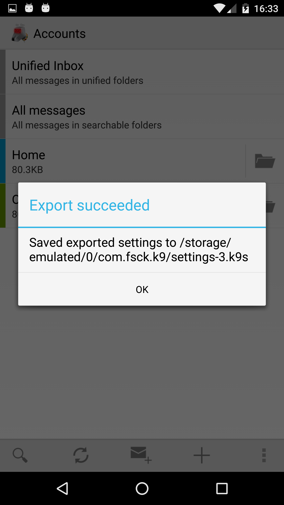
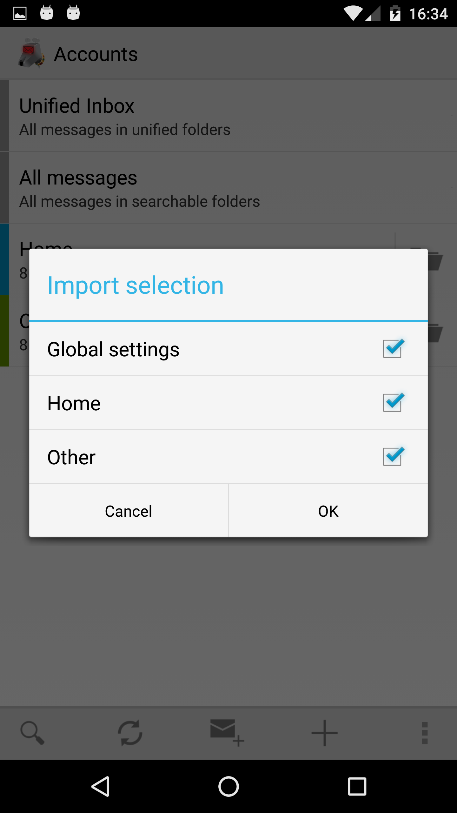

K-9 provides the ability to import and export your settings. This is useful when changing/adding a device.

The settings are exported as a file, stored in [external storage](/documentation/storage) in the directory `com.fsck.k9`, e.g. `/storage/sdcard/com.fsck.k9/settings.k9s`.
You can now move this file to a new device or just keep it there when you uninstall and then re-install K-9 Mail on the same device.
 They do not contain your password.

To export your settings tap the bottom action bar's overflow menu on the accounts page, then "Export settings and accounts"

 

Assuming the export is succesful they will be stored in the K9 folder. This can then be e-mailed or otherwise transferred.

Similarly, tapping "Import settings" allows you to import your settings. The settings are split into sections, allow you to import the section you want.

 

When the import is complete you will be asked to provide the passwords to all the accounts you just imported. You can defer the account activation by pressing "Cancel", but you won't be able to use the account until you provide a password.

